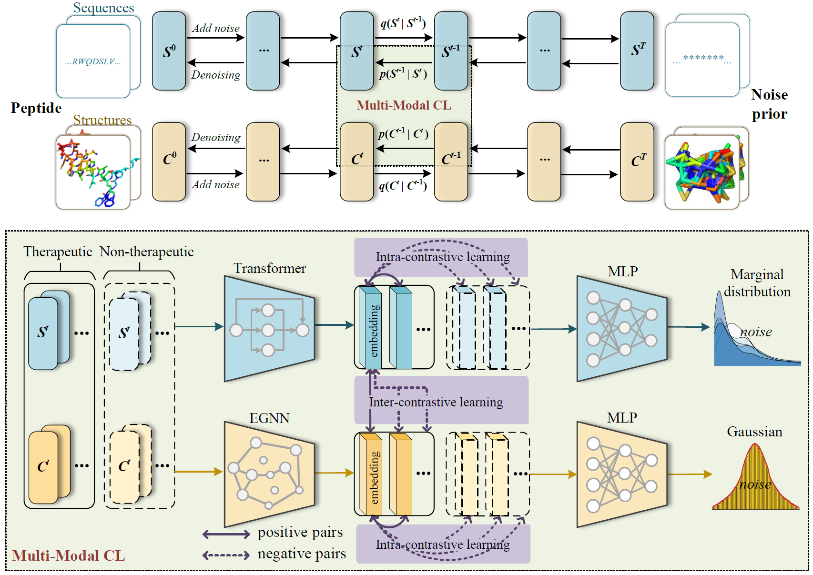

# MMCD Multi-Model Contrastive Diffusion

####  Codes, datasets and appendix for AAAI-2024 paper "A Multi-Modal Contrastive Diffusion Model for Therapeutic Peptide Generation"

## Overview of MMCD 



### The repository is organized as follows

- `data/` contains the datasets used in the MMCD model;
- `models/` contains the implementation of the MMCD model;
- `modules/` contains the data processing and the sequence/structure encoders;
- `utils/` contains the bio-function tools for embeddings and evaluation;
---

### Run code

For how to run MMCD, we present an example based on the AMP dataset, which could be easy extend to other peptide datasets.
1. Download the AMP dataset with fasta files for sequences and pdb files for structures. Then place the files in the specified folder. Due to the large amount of training data required for the model, we upload the source data to Google cloud drive with the resource link (https://drive.google.com/file/d/1PmUFzdTlxFoEcODHqyWPgwJmG4B01lEG/view?usp=drive_link)
- `data/`
  + `source/`
      + `fasta/`: `AMP.fasta`, `nonAMP.fasta`
      + `pdb/`: `AMP/` pdb files for AMP, `nonAMP/` pdb files for nonAMP
      + `aaindex.csv` parameter of amino acid from aaindex
2. Training for diffusion model with the AMP dataset
```
python train.py --n_max_epochs 500 --n_timestep 1000 --out_checkpoint_dir data/output/MMCD
```
